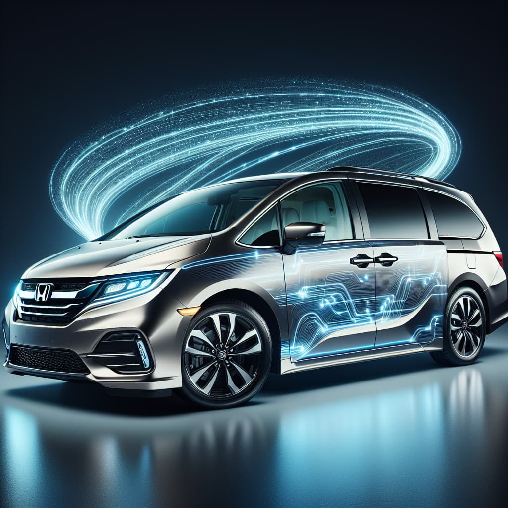

# Oppkey's RICOH THETA Used Car Advisor

Code example for [article on RICOH THETA developer community](https://community.theta360.guide/t/using-ai-to-accelerate-used-car-sales-process/10494)

## Overview

Oppkey's RICOH THETA Used Car Advisor is a chatbot demo that provides information on used cars. It uses a combination of natural language processing and machine learning to provide a personalized experience for each user.

## Features

- Get information on a car by VIN
- Get recommendations for the car identified by the VIN
- Generate image of a car using the VIN

## Technologies Used

- OpenAI API
- Python

## Setup

1. Clone the repository
2. Install the dependencies `pip install -r requirements.txt`
3. Create a `.env` file and add your OpenAI API key `SECRET_KEY=your_openai_api_key`
4. Run the script `python main.py`

## Usage

1. Input a VIN to get started

## Example Output



```
### Tesla Model Y Overview

1. **Body Style and Design**:
   - The Model Y is a compact all-electric crossover SUV.
   - It features a sleek, aerodynamic design similar to the Model 3, but with increased interior space and higher seating position.
   - The vehicle offers a large glass roof, providing an open and airy feel within the cabin.

2. **Performance**:
   - The Model Y comes in different configurations, typically including Long Range and Performance versions.
   - It offers all-wheel drive with dual electric motors (one on each axle) for enhanced traction and control.
   - The Performance model provides exceptionally quick acceleration, going from 0 to 60 mph in just over 3 seconds.

3. **Range and Efficiency**:
   - Depending on the configuration, the Model Y can achieve an estimated range between 300 to 330+ miles on a single charge, according to EPA estimates.
   - Tesla's extensive Supercharger network allows for convenient long-distance travel.

4. **Interior and Features**:
   - The Model Y interior emphasizes minimalism, centered around a large touchscreen display that controls most vehicle functions.
   - It offers seating for up to seven passengers with an optional third-row seat.
   - The interior is equipped with features like advanced climate control, premium audio, and wireless software updates.

5. **Safety and Autopilot**:
   - Tesla vehicles are known for their strong safety features, and the Model Y includes multiple airbags, stability control, and the ability to receive over-the-air updates for new features and safety enhancements.
   - It comes with Tesla's Autopilot capabilities, which include features like adaptive cruise control and lane-keeping assistance. Full Self-Driving is an optional package that adds more advanced features.

6. **Technology**:
   - The car incorporates the latest Tesla technology, including a high-quality infotainment system, navigation, and a suite of sensors and cameras for semi-automated driving and security features (Tesla's Sentry Mode).

The Model Y has gained popularity for its combination of practicality, performance, and technology, making it a versatile choice for many drivers. If you have more specific questions or need information on a particular aspect of the vehicle, feel free to ask!
I'm unable to generate images directly. If you're looking for an image of the 2023 Tesla Model Y, you can find many available online through a search or by visiting the official Tesla website, where you can see high-quality images and explore various configurations.
Enter stop to exit, or input a new message
```